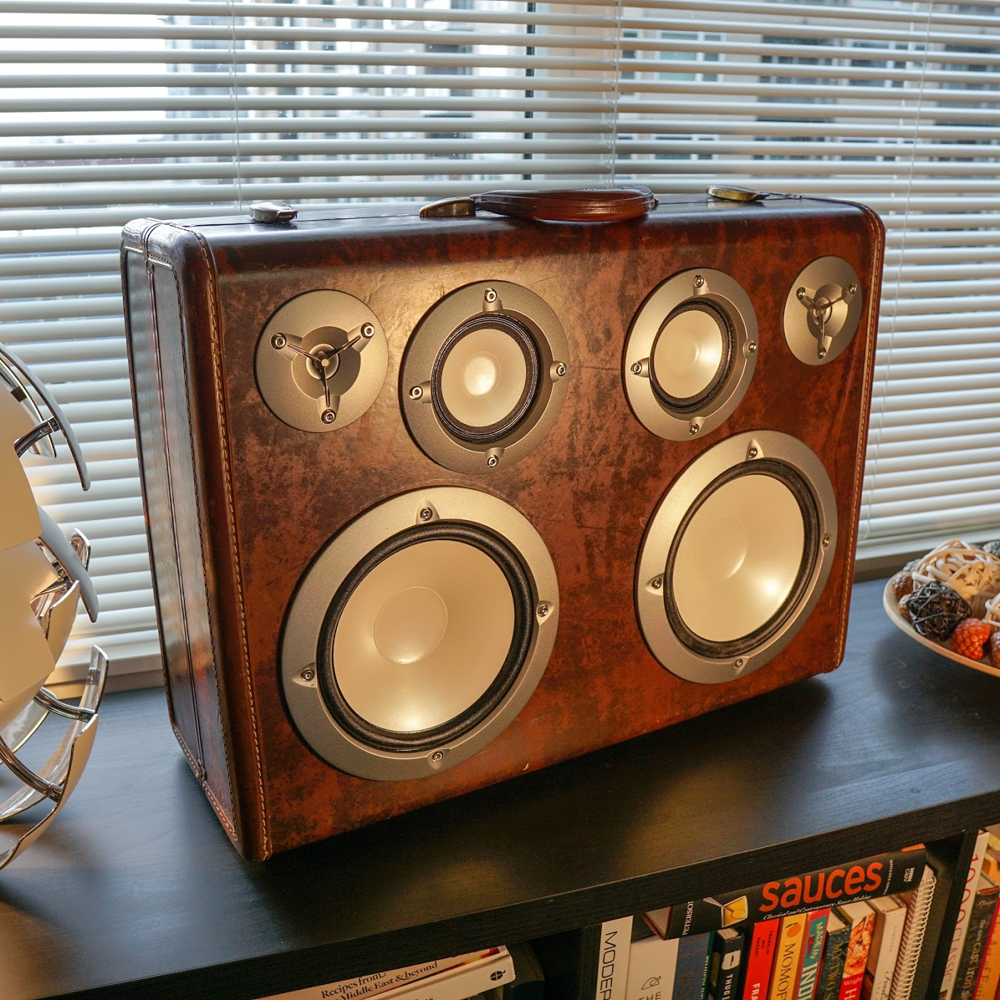

# The SoundCase Project

Welcome to the SoundCase Project! This is a repository to detail the construction of fully-contained suitcase boomboxes. The goal here is to wrap quality speakers into a beautiful and portable enclosure. So far, all the speakers built are battery-powered (12+ hours of battery life), bluetooth integrated, and controllable with status lights. This is made possible thanks to Dayton Audio's wonderful KAB line of self-contained bluetooth speaker components.

## SoundCase 1: Mega

The first speaker was built for block-busting sound and contains 2 3-way speakers driven by 50w of power per channel. At full volume, this easily shakes my apartment, and while being rather heavy due to the suitcase and large drivers used, it's perfect for outdoor use at parties or picnics. 

You can see the bill of materials and list of things that went into the project [here](materials_case1.md)

TODO: Additional README and build log to come.

## SoundCase 2: Mini

The second speaker is now finished! I built it into a perfectly sized veneered plyboard box I found at an antiques market near Pike Place, Seattle. It is fully sealed and much lighter and more portable than SoundCase 1, but the sound is almost as good - those passive radiators on the back lend some amazing bass and I am very impressed with the PS95 point source drivers. 

This speaker uses two 3.5" Dayton Audio PS95-8 drivers, 2 Peerless 3.5" passive radiators, a Dayton KAB-250V3 2x50w amplifier, KAB-BE battery board with 3 3000maH batteries, and a Dayton KAB-PMV3 back panel. 

## Others' examples
This is by no means an original idea, many other makers have paved the way with some awesome suitcase/boombox conversions. The beauty of this project is that it has such flexibility, and no two systems will turn out the same way. For some interesting examples from others, check out the following links: TODO

